# Figma Finder

https://psephopaiktes.github.io/figma-finder/

A browser extension designed to quickly find and open the Figma files you need.


<br /><br />


## Get the Extension
* [Chrome Web Store](https://chrome.google.com/webstore/detail/klifomaejfaibpkbigbpljdmelbkehbe)
<!-- * [Add-ons for Firefox](TODO) -->
<!-- * [Edge Add-ons](TODO) -->


<br /><br />


## Development

A Node.js environment is required.

```zsh
npm i
npm start
```


<!-- <br /><br />


## For Firefox review team
To review the source code and build it, please run the following command:
```zsh
npm run build:firefox
``` -->
